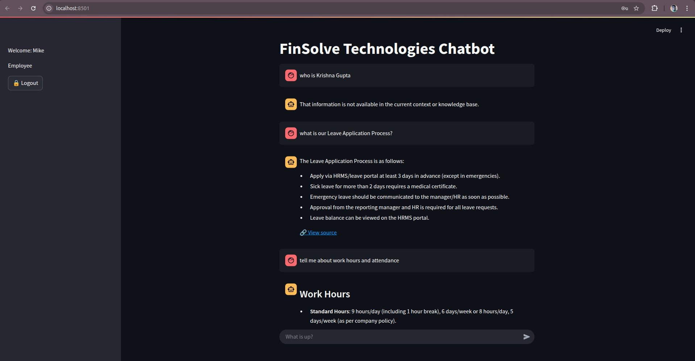

# 🔐 RAG-Based Role-Specific AI Chatbot for FinSolve Technologies

This is an AI-powered chatbot solution built for **FinSolve Technologies**, designed to solve inter-departmental communication delays and data silos by providing **secure, role-based access** to information. Leveraging **RAG (Retrieval-Augmented Generation)**, the chatbot uses OpenAI's GPT models and Qdrant to retrieve and generate **department-specific insights** on demand.

---

---

## 💡 Challenges Faced

Despite being a leading FinTech company, FinSolve faced operational bottlenecks due to:

- ⚠️ Communication delays across departments  
- 🔒 Inconsistent access to sensitive and role-specific data   
- 📉 Slower decision-making processes  
- 🧩 Fragmented data sources and silos

---

## ✅ What This Project Solves

The chatbot was developed to address the above challenges by:

- ✅ Enabling **role-based access** to information using RBAC
- ✅ Leveraging **Generative AI + RAG** for intelligent, context-aware responses
- ✅ Improving **data retrieval efficiency** using Qdrant vector search
- ✅ Supporting **secure communication** with JWT authentication
- ✅ Providing a **simple, intuitive interface** for end-users via Streamlit
- ✅ Offering **PDF downloads** of AI-generated content for reporting and documentation

---

## 🧠 Key Features

- 🔐 **Role-Based Access Control (RBAC):** Each user (Finance, HR, Marketing, Executives, Engineering, Employees) sees only role-relevant data.
- 💬 **Conversational AI:** Uses OpenAI's GPT-4o for high-quality, contextual responses.
- 🔍 **Retrieval-Augmented Generation (RAG):** Combines vector-based search with generative AI to provide accurate, context-aware answers.
- 🧾 **PDF Response Export:** Users can download AI responses in PDF format.
- 🖥️ **Interactive UI:** Built with Streamlit for a clean and intuitive frontend experience.
- ⚡ **FastAPI Backend:** Efficient and lightweight API layer with proper error handling and JWT authentication.
- 🛡️ **Authentication System:** Uses JWT for secure login and session management.
- 🧠 **Vector Search with Qdrant:** Stores pre-embedded documents using `sentence-transformers/all-MiniLM-L6-v2`.
- 🗃️ **SQLite Database:** Stores user credentials and chat history locally for ease of use and portability.

---

## 🛠️ Tech Stack

| Layer       | Technology                                |
|-------------|--------------------------------------------|
| 🧠 LLM       | OpenAI GPT-4o                             |
| 📚 Embedding | `sentence-transformers/all-MiniLM-L6-v2` |
| 🔍 Vector DB | Qdrant                                    |
| 🧠 RAG       | Retriever + Generator                     |
| 🧑‍💻 Backend  | FastAPI                                   |
| 🌐 Frontend  | Streamlit                                 |
| 🗃️ Database  | SQLite                                    |
| 🔐 Auth      | JWT                                       |
| 🐳 DevOps    | Docker (for Qdrant and containerization) |

---

